# Project Architecture: Wobb Influencer Discovery Dashboard

This document details the system design, component structure, state management flow, and data layers for the Influencer Discovery & List Building application.

---

## 1. System Overview & Technical Stack

The dashboard is client-driven, leveraging static JSON files as a mock backend database. It is engineered with:
- **Core Framework**: React 19 & TypeScript for type safety and component modeling.
- **Build Tool & Bundler**: Vite 8.
- **Styling System**: Tailwind CSS v4 & custom modern vanilla CSS variables.
- **State Management**: Zustand (replacing custom prop drilling/Context) with persistent localStorage synchronization.
- **Routing**: React Router v7.
- **Testing**: Vitest for unit testing with localStorage/window mocks for headless Node execution.

---

## 2. Architecture & Data Flow Diagram

The diagram below illustrates how data is ingested, how components interact, and how state transitions propagate through the system:

```mermaid
graph TD
    %% Client Routing
    subgraph Routing ["Routing Layer (React Router v7)"]
        Router["BrowserRouter / RouterProvider"]
        SearchRoute["SearchPage (Route: '/')"]
        DetailRoute["ProfileDetailPage (Route: '/profile/:username')"]
        Router --> SearchRoute
        Router --> DetailRoute
    end

    %% Component Layout
    subgraph UIComponents ["Component Architecture & Hierarchy"]
        LayoutComponent["Layout (Common Frame & Header)"]
        PlatformFilter["PlatformFilter (Platform Tabs & Search Input)"]
        ProfileList["ProfileList (Grid/Flex List Container)"]
        ProfileCard["ProfileCard (Compact Card & Action Button)"]
        CampaignDrawer["CampaignDrawer (Shortlist Drawer & Controls)"]

        LayoutComponent --> PlatformFilter
        LayoutComponent --> ProfileList
        LayoutComponent --> CampaignDrawer
        ProfileList --> ProfileCard
    end

    %% State Management Store
    subgraph StateStore ["Global State (Zustand Store)"]
        Store["useCampaignStore (Zustand)"]
        Storage[(LocalStorage Sync)]
        
        Store <-->|Hydrate / Persist| Storage
    end

    %% Data Pipeline
    subgraph DataLayer ["Data & Loader Layer"]
        SearchJSON["search/*.json (Instagram/YouTube/TikTok)"]
        DetailJSON["profiles/*.json (Dynamic User Details)"]
        StaticLoader["dataHelpers.ts (Static imports + username fallback)"]
        DynamicLoader["profileLoader.ts (import.meta.glob)"]
        Formatters["formatters.ts (Display helpers)"]

        SearchJSON --> StaticLoader
        DetailJSON --> DynamicLoader
    end

    %% Testing Layer
    subgraph TestingLayer ["Testing Layer (Vitest)"]
        FormattersTest["formatters.test.ts"]
        DataHelpersTest["dataHelpers.test.ts"]
        StoreTest["campaignStore.test.ts"]
    end

    %% Data and State Interactions
    StaticLoader -->|Provides platform summary list| SearchRoute
    DynamicLoader -->|Asynchronously loads detail profile| DetailRoute
    Formatters -->|formatFollowers, formatEngagementRate| ProfileCard
    Formatters -->|formatFollowers| CampaignDrawer

    Store -->|selectedProfiles state & action toggles| ProfileCard
    Store -->|selectedProfiles state & remove action| CampaignDrawer
    Store -->|selectedProfiles state & add/remove action| DetailRoute

    %% Test coverage links
    FormattersTest -.->|tests| Formatters
    DataHelpersTest -.->|tests| StaticLoader
    StoreTest -.->|tests| Store
```



---

## 3. Core Component Catalog

The project components are classified into layout wrappers, list elements, detail blocks, and selection widgets:

### 1. Structure & Layout
* **[Layout](file:///Users/omkar/Downloads/vibe-coder-assignment-main/src/components/Layout.tsx)**: Provides the global frame (navigation header, brand title, responsive constraints). Includes the trigger/entry point for the Campaign Selection Panel.
* **[CampaignDrawer](file:///Users/omkar/Downloads/vibe-coder-assignment-main/src/components/CampaignDrawer.tsx)**: A responsive side-drawer that displays the list of shortlisted influencers. It allows users to review, remove items, clear the list, or export to CSV.

### 2. Search & Filtering
* **[PlatformFilter](file:///Users/omkar/Downloads/vibe-coder-assignment-main/src/components/PlatformFilter.tsx)**: Manages platform categories ("Instagram", "YouTube", "TikTok") and contains the search input bar.
* **[SearchBar](file:///Users/omkar/Downloads/vibe-coder-assignment-main/src/components/SearchBar.tsx)**: Basic standalone text input helper.

### 3. Display Cards & Lists
* **[ProfileList](file:///Users/omkar/Downloads/vibe-coder-assignment-main/src/components/ProfileList.tsx)**: Maps through the active platform profiles and renders them inside a flex/grid setup.
* **[ProfileCard](file:///Users/omkar/Downloads/vibe-coder-assignment-main/src/components/ProfileCard.tsx)**: Renders critical overview details (name, avatar, follower counts, verified badges) and an **Add to List / Remove** context action.
* **[VerifiedBadge](file:///Users/omkar/Downloads/vibe-coder-assignment-main/src/components/VerifiedBadge.tsx)**: Small presentational component rendering the blue verified checkmark icon.

### 4. Page Layouts
* **[SearchPage](file:///Users/omkar/Downloads/vibe-coder-assignment-main/src/pages/SearchPage.tsx)**: Synthesizes search states, manages platform filtering, binds profile clicks, and acts as the entry page.
* **[ProfileDetailPage](file:///Users/omkar/Downloads/vibe-coder-assignment-main/src/pages/ProfileDetailPage.tsx)**: Fetches and displays granular metrics (engagement rates, average views, posts count, average comments) dynamically from JSON files, offering detailed marketing insight.

---

## 4. State Management (Zustand Store)

To decouple campaign shortlisting from component layouts, state is centralized in a Zustand store. This replaces direct component prop-drilling.

### Store Specification (`campaignStore`)
```typescript
interface CampaignState {
  // State
  selectedProfiles: UserProfileSummary[];
  isDrawerOpen: boolean;

  // Actions
  toggleDrawer: () => void;
  setDrawerOpen: (open: boolean) => void;
  addProfile: (profile: UserProfileSummary) => void;
  removeProfile: (userId: string) => void;
  clearList: () => void;
  isProfileSelected: (userId: string) => boolean;
}
```

### Persistence Logic
The store is bound to the `persist` middleware of Zustand:
- **Storage Target**: `window.localStorage`
- **Key**: `"wobb-campaign-store"`
- **Auto-Hydration**: List selections are automatically re-populated when the application reloads.

---

## 5. Data Flow & Resolution Model

Data resolution is split into two modes: static compilation-time references for indexing, and dynamic on-demand imports for detail pages to minimize initial bundle size.

1. **Static Index Loading (`search/*.json`)**:
   Summary data for Instagram, YouTube, and TikTok influencers is imported directly at the top of the helper class [dataHelpers.ts](file:///Users/omkar/Downloads/vibe-coder-assignment-main/src/utils/dataHelpers.ts). This makes initial searches instantaneous.

2. **Username Fallback Pipeline**:
   During extraction, `extractProfiles` normalizes each profile to guarantee the `username` field is always populated. Some YouTube entries lack this property, so the pipeline falls back to `handle`, then `custom_name`, then an empty string. The `filterProfiles` function also applies defensive null-checks and case-insensitive matching.

3. **Dynamic Detail Loading (`profiles/*.json`)**:
   Individual detailed JSON profiles are imported on-demand using Vite's `import.meta.glob` tool in [profileLoader.ts](file:///Users/omkar/Downloads/vibe-coder-assignment-main/src/utils/profileLoader.ts):
   ```typescript
   const profileModules = import.meta.glob<ProfileDetailResponse>("../assets/data/profiles/*.json");
   ```
   This ensures that detailed profile statistics are only fetched over the network or evaluated when a user navigates to `/profile/:username`.

4. **Display Formatting**:
   [formatters.ts](file:///Users/omkar/Downloads/vibe-coder-assignment-main/src/utils/formatters.ts) provides shared formatting helpers (`formatFollowers`, `formatEngagementRate`) used by `ProfileCard`, `CampaignDrawer`, and `ProfileDetailPage` to render human-readable metric labels.

---

## 6. Key Design Patterns & Guidelines

- **Atomic Components**: Components should have single, well-defined responsibilities. Business state logic is kept inside the Zustand store, while display layers remain purely presentation-focused.
- **Type Safety**: All inputs, JSON configurations, platform keys, and function signatures must strictly conform to TypeScript interfaces declared in `src/types/index.ts`.
- **Responsive Layouts**: Layout classes must avoid absolute sizing (`w-[700px]`, `w-175`). Instead, flexbox and CSS grids with responsive breakpoints (`grid-cols-1 md:grid-cols-2 lg:grid-cols-3`) must be applied.

---

## 7. Testing Architecture

The project uses **Vitest** for unit testing, running via `npm run test`. Tests are co-located alongside source files:

| Test File | Module Under Test | Key Assertions |
| --- | --- | --- |
| [formatters.test.ts](file:///Users/omkar/Downloads/vibe-coder-assignment-main/src/utils/formatters.test.ts) | `formatters.ts` | Million/thousand formatting, undefined engagement rate handling |
| [dataHelpers.test.ts](file:///Users/omkar/Downloads/vibe-coder-assignment-main/src/utils/dataHelpers.test.ts) | `dataHelpers.ts` | Platform labels, username fallback mapping, case-insensitive search filtering |
| [campaignStore.test.ts](file:///Users/omkar/Downloads/vibe-coder-assignment-main/src/store/campaignStore.test.ts) | `campaignStore.ts` | Add/remove/clear profiles, duplicate prevention, drawer toggle |

### Node Environment Mocking
Since Zustand's `persist` middleware expects a browser environment, the store tests inject `globalThis.localStorage` and `globalThis.window` mocks **before** dynamically importing the store module. This avoids `"storage is currently unavailable"` warnings in headless test runs.
